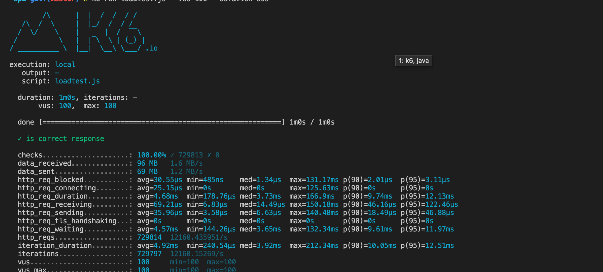
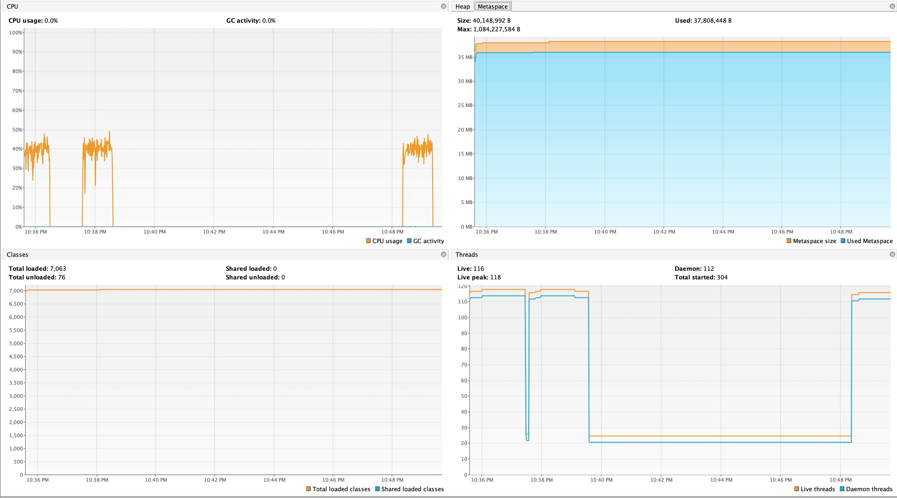

# POI Pricing

A little experiment to see how we can dynamically calculate pricing with [Apache POI](https://poi.apache.org/) + a spreadsheet

First, `cd api`. Then:

### The spreadsheets

**SimpleCalculation.xlsx** - Just a simple spreadsheet with 4 values to be summed up.

**AdvancedCalculation.xlsx** - Advanced spreadsheet that calculates projected revenue of a clinic. With colors, macros, lots of values and formulas - A real scenario of what an actuary will produce.

### Setup

1. `./gradlew bootRun`

2. **Simple case**: GET `http://localhost:8080/calculate/simple/780` or any number `http://localhost:8080/calculate/simple/{value}`

3. **Advanced case**: GET `http://localhost:8080/calculate/advanced?medicard=0.1&managedCare=0.1&privateInsurance=0.2&selfPay=0.6`

### Run the load test

1. Install [k6](https://k6.io/)

2. Run the simple scenario with 100 concurrent users over 60s - `k6 run loadtest/simple.js --vus 100 --duration 60s`

3. Tested on a machine with 6 cores - Got 9-10K rps. Your results may vary. See this [PR](https://github.com/geekyme/poi-pricing/pull/3)

|      Loadtest       |      Monitor      |
| :-----------------: | :---------------: |
|  |  |

4. (Optional) to run the advanced scenario - `k6 run loadtest/advanced.js --vus 100 --duration 60s`. This one clocks about 250 rps

5. (Optional) to run all scenarios - `k6 run loadtest/index.js --vus 100 --duration 60s`
